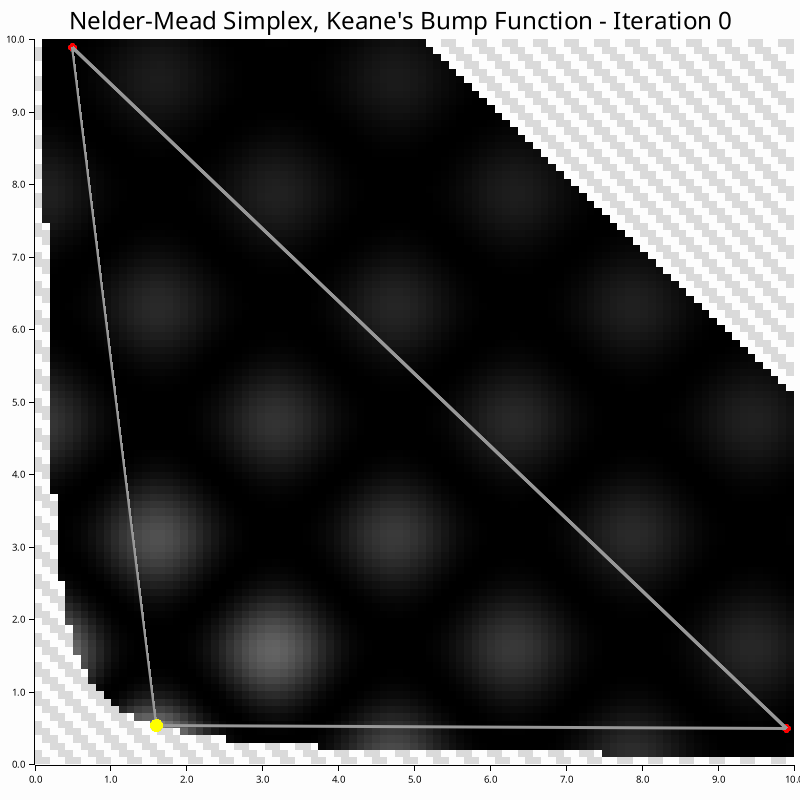

# NonConvex-RUST
[](LICENSE)

Continuous non-convex optimizers implemented in RUST for constrained and unconstrained maximization problems. 

Sources/links to more information in the respective algorithm .md files.

## Installation

Add this to your `Cargo.toml`:

```toml
[dependencies]
non_convex_opt = "0.1.0"
```

## Importing

```rust
use non_convex_opt::NonConvexOpt;
use non_convex_opt::utils::config::{Config, OptConf, AlgConf};
use non_convex_opt::utils::opt_prob::{ObjectiveFunction, BooleanConstraintFunction};
use nalgebra::{DVector, DMatrix};
```

## Usage

```rust
// Load config from file
let config = Config::new(include_str!("config.json")).unwrap();

// Or create config from JSON string
let config_json = r#"{
    "opt_conf": {
        "max_iter": 1000,
        "rtol": "1e-6", 
        "atol": "1e-6",
        "rtol_max_iter_fraction": 1.0
    },
    "alg_conf": {
        "CGA": {
            "common": {
                "population_size": 100,
                "num_parents": 2,
            },
            "crossover": {
                "Heuristic": {
                    "crossover_prob": 0.8
                }
            },
            "selection": {
                "Tournament": {
                    "tournament_size": 2
                }
            }
        }
    }
}"#;

let config = Config::new(config_json).unwrap();

let mut opt = NonConvexOpt::new(
    config,
    init_x, // Initial population - must be a DMatrix from nalgebra
    obj_f,  // Objective function
    Some(constraints) // Optional constraints
);

// Unconstrained optimization
let mut opt = NonConvexOpt::new(
    config,
    init_x,
    obj_f,
    None::<EmptyConstraints>
);

let result = opt.run();
```
To see the differences between setting up unconstrained and constrained problems, please refer to the [benches/](./benches) subdirectory. See the [examples/](./examples) subdirectory for more direction on using the lib.

## Examples

The following GIFs are based on the [2D unconstrained maximization problems](./examples/test_functions.md) in the [examples/](./examples) subdirectory.

### Population-Based 
|  |  |
|-----------|---------------|
| [Continuous Genetic Algorithm (CGA)](./src/continous_ga/CGA.md) - Population-based natural selection |  |
|  | [Parallel Tempering (PT)](./src/parallel_tempering/PT.md) - Multi-temperature Monte Carlo sampling |

### Local Search 
|  |  |
|-----------|---------------|
| [Tabu Search (TS)](./src/tabu_search/tabu.md) - Local search with memory |  |
|  | [Greedy Randomized Adaptive Search Procedure (GRASP)](./src/grasp/GRASP.md) - Construction and local search |

### Gradient-Based 

These work better with mini-batches!

|  |  |
|-----------|---------------|
| [Adam](./src/adam/ADAM.md) - Adaptive Moment Estimation |  |
|  | [Stochastic Gradient Ascent (SGA)](./src/sg_ascent/SGA.md) - Gradient-based optimization |

### Direct Search

|  |  |
|-----------|---------------|
| [Nelder-Mead](./src/nelder_mead/NM.md) - Direct search with simplex |  |

## Config


The config is structured as follows:

- `OptConf` - Optimization configuration
- `AlgConf` - Algorithm configuration, containing one of:
    - `CGAConf` - Continuous Genetic Algorithm configuration
        - `CommonConf` - Common configuration
        - `SelectionConf` - Selection method configuration
        - `CrossoverConf` - Crossover method configuration
    - `PTConf` - Parallel Tempering configuration
        - `CommonConf` - Common configuration
        - `SwapConf` - Swap configuration
    - `TabuConf` - Tabu Search configuration
        - `CommonConf` - Common configuration
        - `ListType` - List type configuration
            - `StandardConf` - Standard list configuration
            - `ReactiveConf` - Reactive list configuration
    - `GRASPConf` - Greedy Randomized Adaptive Search Procedure configuration
    - `AdamConf` - Adam configuration
    - `SGAConf` - Stochastic Gradient Ascent configuration
    - `NelderMeadConf` - Nelder-Mead configuration

Example configs are provided in [tests/jsons/](tests/jsons). More information on each config can be found in the respective algorithm .md files.

## Contributing

1. Fork the repository
2. Create a new branch: `git checkout -b my-feature`
3. Make your changes
4. Run tests: `cargo test`
5. Run benchmarks: `cargo bench`    
    - To view the results, run:
    ```bash
    open target/criterion/report/index.html  # on macOS
    xdg-open target/criterion/report/index.html  # on Linux
    start target/criterion/report/index.html  # on Windows
    ```
6. Add sources and more information to the respective algorithm .md file - so that others can learn and share too!
7. Commit and push
8. Open a Pull Request

## License

This project is licensed under the GNU General Public License v3.0 - see the [LICENSE](LICENSE) file for details.
