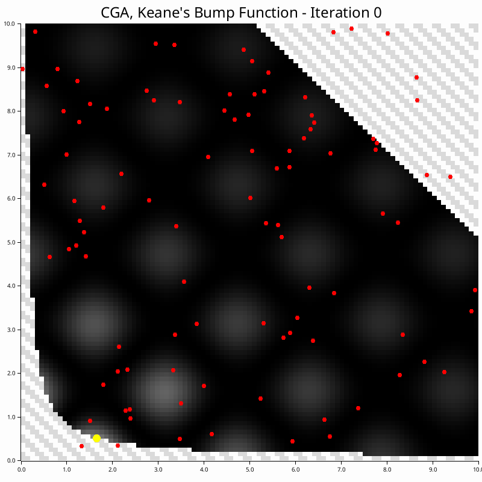
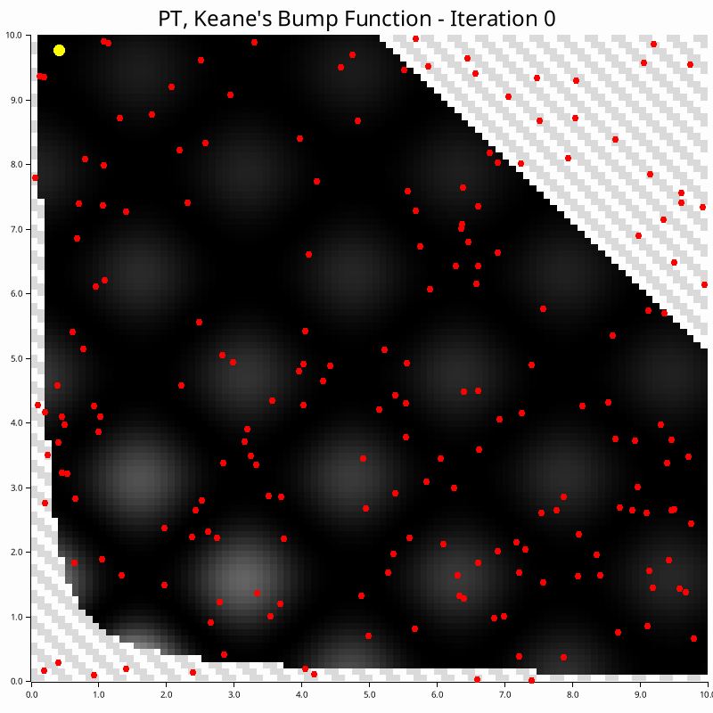

# NonConvex-RUST
[](LICENSE)

Continous non-convex optimizers implemented in RUST for constrained and unconstrained maximization problems. 

Sources/links to more information in the respective algorithm .md files.

## Installation

Add this to your `Cargo.toml`:

```toml
[dependencies]
non_convex_opt = "0.1.0"
```

## Importing

```rust
use non_convex_opt::NonConvexOpt;
use non_convex_opt::utils::config::{Config, OptConf, AlgConf, CGAConf, PTConf, TabuConf, GRASPConf, AdamConf};
use non_convex_opt::utils::opt_prob::{ObjectiveFunction, BooleanConstraintFunction};
use nalgebra::{DVector, DMatrix};
```

## Usage

```rust
// Load config from file, (preferred - handles default values)
let config = Config::new(include_str!("config.json")).unwrap();

// Or create config directly, (does not handle default values)
let config = Config {
    opt_conf: OptConf {
        max_iter: 1000,
        rtol: 1e-6,
        atol: 1e-6,
        rtol_max_iter_fraction: 1.0,
    },
    alg_conf: AlgConf::CGA(CGAConf {
        population_size: 100,
        num_parents: 2,
        selection_method: "Tournament".to_string(),
        crossover_method: "Random".to_string(),
        crossover_prob: 0.8,
        tournament_size: 2,
    }),
};

let mut opt = NonConvexOpt::new(
    config,
    init_x, // Initial population - must be a DMatrix from nalgebra
    obj_f,  // Objective function
    Some(constraints) // Optional constraints
);

// Unconstrained optimization
let mut opt = NonConvexOpt::new(
    config,
    init_x,
    obj_f,
    None::<EmptyConstraints>
);

let result = opt.run();
```
To see the differences between setting up unconstrained and constrained problems, please refer to the [benches/](./benches) subdirectory. See the [examples/](./examples) subdirectory for more direction on using the lib.

## Examples

The following GIFs are based on poor initializations of the [2D unconstrained maximization problems](./examples/test_functions.md) in the [examples/](./examples) subdirectory.

### Population-Based 
|  |  |
|-----------|---------------|
| [Continuous Genetic Algorithm (CGA)](./src/continous_ga/CGA.md) - Population-based natural selection |  |
|  | [Parallel Tempering (PT)](./src/parallel_tempering/PT.md) - Multi-temperature Monte Carlo sampling |

### Local Search 
|  |  |
|-----------|---------------|
| [Tabu Search (TS)](./src/tabu_search/tabu.md) - Local search with memory |  |
|  | [Greedy Randomized Adaptive Search Procedure (GRASP)](./src/grasp/GRASP.md) - Construction and local search |

### Gradient-Based 

These work better with mini-batches!

|  |  |
|-----------|---------------|
| [Adam](./src/adam/ADAM.md) - Adaptive Moment Estimation |  |
|  | [Stochastic Gradient Ascent (SGA)](./src/sg_ascent/SGA.md) - Gradient-based optimization |
## Config

The config is structured as follows:

- `OptConf` - Optimization configuration
- `AlgConf` - Algorithm configuration, containing one of:
    - `CGAConf` - Continuous Genetic Algorithm configuration
    - `PTConf` - Parallel Tempering configuration
    - `TabuConf` - Tabu Search configuration
    - `GRASPConf` - Greedy Randomized Adaptive Search Procedure configuration
    - `AdamConf` - Adam configuration

An example is provided in [tests/](https://github.com/PritRaj1/NonConvex-RUST/blob/main/tests/config.json). The default values are:

```json
    {
    "opt_conf": {
            "max_iter": 1000,
            "rtol": 1e-6,
            "atol": 1e-6,
            "rtol_max_iter_fraction": 1.0
        },
    "alg_conf": {
        "cga": {
            "population_size": 100,
            "num_parents": 2,
            "selection_method": "tournament",
            "crossover_method": "uniform",
            "crossover_prob": 0.8,
            "tournament_size": 2
        },
        "pt": {
            "num_replicas": 10,
            "power_law_init": 2.0,
            "power_law_final": 0.5,
            "power_law_cycles": 1,
            "alpha": 0.1,
            "omega": 2.1,
            "swap_check_type": "Always",
            "swap_frequency": 1.0,
            "swap_probability": 0.1,
            "mala_step_size": 0.01
        },
        "ts": {
            "tabu_list_size": 20,
            "num_neighbors": 50,
            "step_size": 0.1,
            "perturbation_prob": 0.3,
            "tabu_threshold": 1e-6,
            "tabu_type": "Standard",
            "min_tabu_size": 10,
            "max_tabu_size": 30,
            "increase_factor": 1.1,
            "decrease_factor": 0.9
        },
        "grasp": {
            "num_candidates": 30,
            "alpha": 0.3,
            "num_neighbors": 10,
            "step_size": 0.1,
            "perturbation_prob": 0.3
        },
        "adam": {
            "learning_rate": 0.01,
            "beta1": 0.9,
            "beta2": 0.999,
            "epsilon": 1e-8
        }
    }
}
```

## Benchmarking

Benchmarks are collected with criterion:
```bash
cargo bench
```
To view the results, run:
```bash
open target/criterion/report/index.html  # on macOS
xdg-open target/criterion/report/index.html  # on Linux
start target/criterion/report/index.html  # on Windows
```

## License

This project is licensed under the GNU General Public License v3.0 - see the [LICENSE](LICENSE) file for details.
