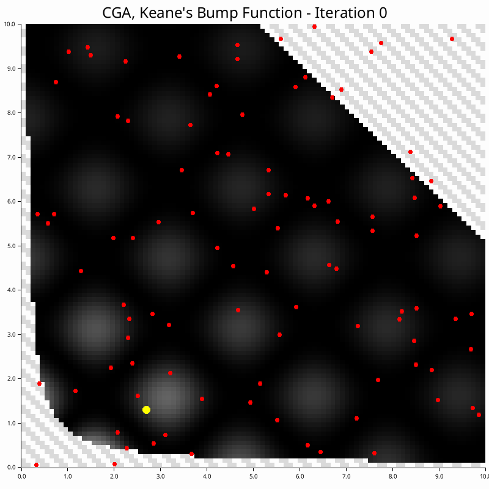

# NonConvex-RUST
Non-convex optimizers implemented in RUST for constrained and unconstrained maximization problems. 

These are fairly standard algorithms, but slightly augmented with some features. 

The following GIFs are based on the [2D unconstrained maximization problem](./examples/test_function.md) in the 'examples' subdirectory.

| Algorithm | Description | Visualization |
|-----------|-------------|---------------|
| [Continuous Genetic Algorithm (CGA)](./src/continous_ga/CGA.md) | Population-based natural selection |  |
| [Parallel Tempering (PT)](./src/parallel_tempering/PT.md) | Multi-temperature Monte Carlo sampling |  |
