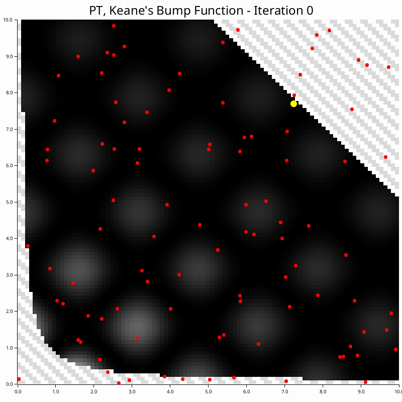

# NonConvex-RUST
Non-convex optimizers implemented in RUST for constrained and unconstrained maximization problems. 

Sources/links to more information in the respective algorithm .md files.

## Examples

The following GIFs are based on the [2D unconstrained maximization problem](./examples/test_function.md) in the 'examples' subdirectory.

|  |  |
|-----------|---------------|
| [Continuous Genetic Algorithm (CGA)](./src/continous_ga/CGA.md) - Population-based natural selection |  |
|  | [Parallel Tempering (PT)](./src/parallel_tempering/PT.md) - Multi-temperature Monte Carlo sampling |
