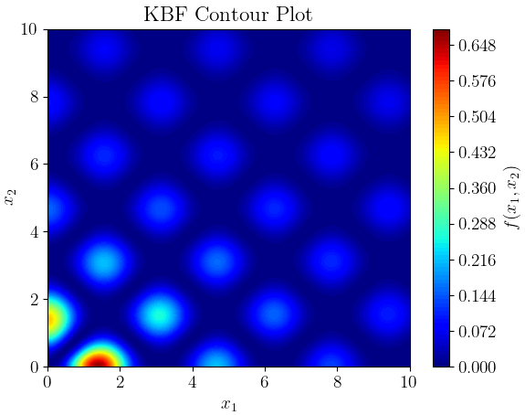
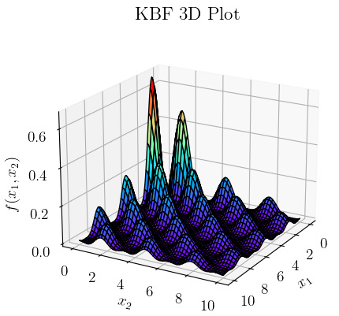

# Example GIFs

The examples in this subdirectory are concerned with creating GIFs of the algorithm's progress against the following constrained optimization problem. 

We refer to this problem as "Keane's Bump Function", and the GIF plots the evolution of the population overlayed on its 2D realization.

## Keane's Bump Function

```math
\max f(\mathbf{x}) = \left| 
\frac{
\sum_{i=1}^{n} (\cos(x_i))^4 - 2 \prod_{i=1}^{n} (\cos(x_i))^2
}{
\sqrt{ \sum_{i=1}^{n} i \cdot x_i^2 }
}
\right|
```

```math
\text{subject to} \quad 0 \leq x_i \leq 10 \quad \forall i \in \{1, \ldots, n\}
```

```math
\prod_{i=1}^{n} x_i > 0.75
```

```math
\sum_{i=1}^{n} x_i < \frac{15n}{2}
```

<p align="center">
 
</p>

## Sources and more information

- [Keane's Bump Function](https://doi.org/10.1016/S0952-1976(99)00033-0)